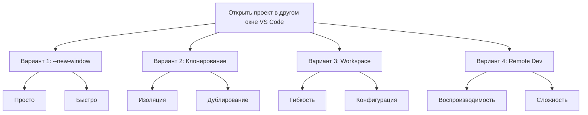

# План открытия проекта WatersysPro в другом окне VS Code

## Контекст
Проект WatersysPro находится в репозитории Git по пути `d:/WatersysPro/WatersysPro`. Пользователь хочет открыть этот же проект в другом окне VS Code, возможно для параллельной работы или разделения задач.

## Варианты реализации

### Вариант 1: Использование команды `code` с флагом `--new-window`
```bash
code "d:/WatersysPro/WatersysPro" --new-window
```
**Преимущества:**
- Простейший способ
- Открывает проект в новом окне VS Code
- Сохраняет все настройки и расширения

**Недостатки:**
- Оба окна будут работать с одним и тем же физическим каталогом
- Возможны конфликты при одновременном редактировании файлов

### Вариант 2: Клонирование репозитория в другую папку и открытие
```bash
# Клонировать в соседнюю папку
cd d:/WatersysPro
git clone WatersysPro WatersysPro-copy
code "d:/WatersysPro/WatersysPro-copy"
```
**Преимущества:**
- Полная изоляция изменений
- Можно экспериментировать без риска повредить основной проект
- Можно работать с разными ветками одновременно

**Недостатки:**
- Занимает дополнительное место на диске
- Требует синхронизации изменений между копиями

### Вариант 3: Использование Workspace файлов (.code-workspace)
1. Создать workspace файл:
```json
{
  "folders": [
    {
      "path": "."
    }
  ],
  "settings": {}
}
```
2. Открыть workspace в новом окне:
```bash
code "d:/WatersysPro/WatersysPro/WatersysPro.code-workspace" --new-window
```

**Преимущества:**
- Можно настраивать разные workspace с разными настройками
- Удобно для разных конфигураций проекта (разработка, отладка, документация)

**Недостатки:**
- Требует создания дополнительного файла конфигурации

### Вариант 4: Использование Remote Development (WSL, Containers, SSH)
Если нужно открыть проект в другом контексте (например, в контейнере Docker):
1. Установить расширение "Remote - Containers"
2. Создать `.devcontainer/devcontainer.json`
3. Открыть в контейнере

**Преимущества:**
- Полная изоляция среды разработки
- Воспроизводимость окружения

**Недостатки:**
- Сложная настройка
- Требует Docker

## Рекомендуемый подход

Для простого открытия в другом окне рекомендуется **Вариант 1**, так как он:
1. Самый быстрый и простой
2. Не создает дубликатов кода
3. Позволяет работать с одним источником истины

Если нужна изоляция для экспериментов - **Вариант 2**.

## Пошаговый план реализации

### Шаг 1: Проверка доступности VS Code в PATH
```bash
code --version
```

### Шаг 2: Открытие проекта в новом окне
```bash
cd "d:/WatersysPro/WatersysPro"
code . --new-window
```

### Шаг 3: Настройка окон (опционально)
- Разместить окна на разных мониторах
- Настроить разные цветовые темы для различия
- Открыть разные файлы в каждом окне

### Шаг 4: Проверка работы
- Убедиться, что оба окна открывают один и тот же проект
- Проверить, что изменения в одном окне отражаются в другом
- Убедиться, что Git работает корректно в обоих окнах

## Потенциальные проблемы и решения

### Проблема 1: Конфликты редактирования
**Решение:** VS Code предупреждает о внешних изменениях файлов. Можно настроить авто-обновление.

### Проблема 2: Потребление памяти
**Решение:** Закрыть ненужные расширения в одном из окон.

### Проблема 3: Путаница окон
**Решение:** Использовать разные иконки или цветовые темы для окон.

## Диаграмма вариантов



## Следующие шаги
1. Выбрать предпочтительный вариант
2. Реализовать выбранный вариант
3. Проверить работоспособность
4. Документировать процесс для будущего использования